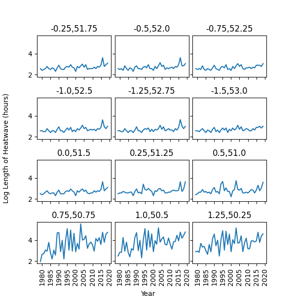
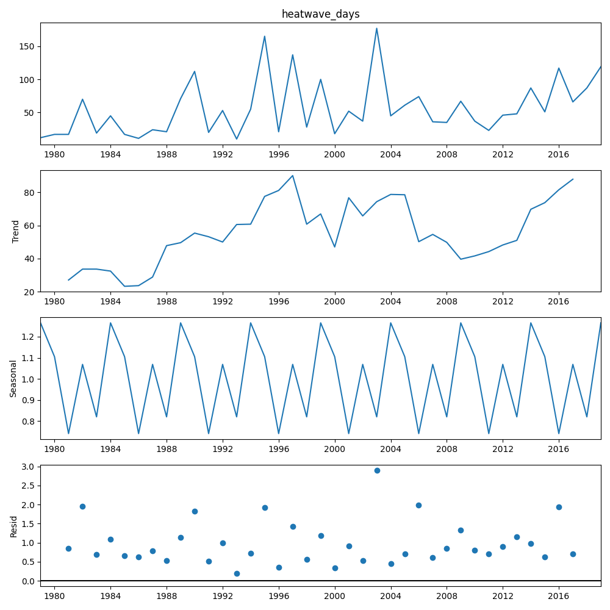

```{r setup, include=FALSE}
knitr::opts_chunk$set(echo = TRUE)
```

## Inspecting the Data

The file given provides temperature data for 13 different locations, most of which are in the UK (chart 1), however we can also see that the locations go across the channel and into France.

<div class = "row">
  <div class = "col-md-6" style="padding: 20px;">
  Chart 1: Plotting the geographical coordinates
  {width=400px}
  </div>
</div>

When plotting the recorded temperatures, across any of the locations, we can see that there is a large spike in 2010 where temperatures are too large by a factor of 10 (chart 2).

These anomalies are corrected by making any value > 2000 degrees Kelvin a factor of 10 smaller. This corrects for the issue and gives a better picture as seen in chart 3. However, even in chart 3 you can see there is an extra issue with the dataset. For the year 2000 there is a break in the series for each location, if I had more time I would impute these values based on previous trends, but for now I have left them as NAs.


<div class = "row">

  <div class = "col-md-6" style="padding: 20px;">
  Chart 2: Anomalies in the time series data
  {width=400px} 
  </div>

  <div class = "col-md-6" style="padding: 20px;">
  Chart 3: Time series charts after anomaly correction
  {width=400px} 
  </div>
  
</div>

Chart 3 above is not that easy to interpret, so instead I have taken a 1 year moving average to be able to observe the trends better. Chart 4 below makes it more obvious that there is data missing in the year 2000. It also shows us there is an upward trend in temperatures for each location.

<div class = "row">
  <div class = "col-md-6" style="padding: 20px;">
  Chart 4: 1 Year moving average by location
  {width=400px}
  </div>
</div>


## Longest Average Heatwave by location and year

To calculate the maximum heatwave by location and year the data was first put into a pandas dataframe so the calculations could be ran across each location more easily. Once each heatwave was calculated as being > 95th percentile for that location, the local maximum heatwave duration for each year and location was then calculated. In Chart 5 this has been further transformed into log hours as otherwise you would not be able to see the trends in the first 9 charts due to large levels differences.


<div class = "row">
  <div class = "col-md-6" style="padding: 20px;">
  Chart 5: Log duration of max heatwave hours by year and location
  {width=400px}
  </div>
</div>


Across each of the 13 locations the average heatwave hours was 24.86. The maximum was 259 hours while the standard deviation came out at 27.07 hours.

## Is there a statistically significant upward trend in heatwaves by location?

Before testing an upward trend in heatwaves, we can first decompose each location heatwaves duration into the trend component and the seasonal component. Chart 6 shows what this looks like for an example location, where we can clearly see there is an upward direction of travel for the trend component. Although no tests have been done, this is an intuitive way to split the seasonality component from the trend component as we are dealing with a time series model.

<div class = "row">
  <div class = "col-md-6" style="padding: 20px;">
  Chart 6: Trend vs Seasonality decomposition example
  {width=400px}
  </div>
</div>

However, we can also test the significance of the length of heatwaves in each of the locations. By running the mann-kendall-test on each location we can see from table 1 below that 12 out of the 13 locations have a statistically significant increasing trend in heatwave length, with the p-values being highly significant in most locations.


<div class = "row">
  <div class = "col-md-6" style="padding: 20px;">
  Table 1: The mann-kendall-test
  {width=400px}
  </div>
</div>


# Question 5

Assume the grid-cell centered at the (lat, lon) coordinates (51.5, 0)  has a heatwave of length 10 days in the year 2050. Based on this, describe how you would estimate the length of heatwave for that year in the nearby grid-cell (51.75, -1.25). What are the assumptions and limitations of the suggested approach?


Given the two locations are close by, you would hope that they would follow a similar path. In time series most series are a random walk, they move randomly and cannot be predicted. My econometrics teacher enjoyed alluding to the fact that you can imagine a random walk as a drunk person walking home, you cannot predict their next step as they are swaying side to side. However, you may get a drunk person holding on to their friends arm as they both drunkenly walk home, both walking unpredictably but they are co-integrated together.

They are two random walks walking together, much like our two locations reporting temperature data, both are random walks with a similar trend. You would assume they are co-integrated together, if one has a large increase in temperature then the other one likely will as well. Therefore I would test if the two time series are co-integrated together and see if there is any granger causality between them. Once you have the co-integration relationship and you witness point (51.5, 0) having a heatwave length of 10 days, you can then use that model to predict the nearby location (51.75, -1.25). In practice this means testing for co-integration and then creating a VAR model between the two series.

# Question 6 - how would you evaluate the quality of the prediction?

Ideally you would run the model on a test, validation and training sample. The model would be ran on the training sample while using the validation sample to pick the best model. Accuracy can then be quantified using the test sample by using metrics like the mean squared error. 

# Implementing questions 5 and 6

Running a co-integration test in python between the two series gives a p-value of 0.034 meaning we can reject the hypothesis that there is no co-integrating relationship. 

Now we can create a VAR model, where we want each time series to be stationary which we can test with the Augmented Dickey-Fuller Test (ADF Test). Testing for a unit root in this way both gave p-values < 0.001 therefore the null hypothesis is rejected; it suggests the time series does not have a unit root, meaning it is stationary. 

When making the VAR model we can test which lag order to use, Table 2 below shows that each metric picks a lag of 0 as the optimal number of lags.

<div class = "row">
  <div class = "col-md-6" style="padding: 20px;">
  Table 2: VAR Optimal Lags Test
  {width=400px}
  </div>
</div>

Despite picking a lag of order 0, I picked a model with one lag to get a better interpretation of the results. What is nice here is that when looking at the 51.75, -0.25 model, which is the location we are trying to predict, we can see that the 51.50, 0 location has a significant 1.36 coefficient e.g. if the 51.50 location was 10 hours then next period the 51.75, -0.25 model should be 1.36*10 hours (plus the rest of the model).


<div class = "row">
  <div class = "col-md-6" style="padding: 20px;">
  Table 2: VAR Optimal Lags Test
  {width=400px}
  </div>
</div>


If I had more time I would look into the model further, provide the prediction results/charts and accuracy metrics etc.


