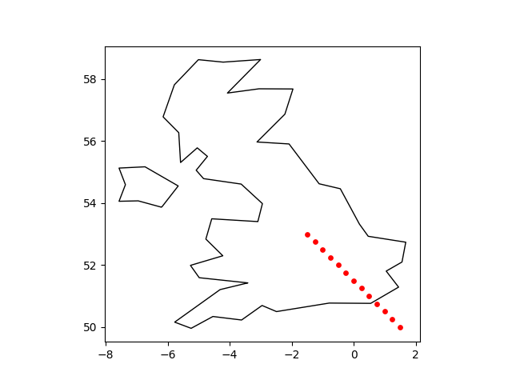
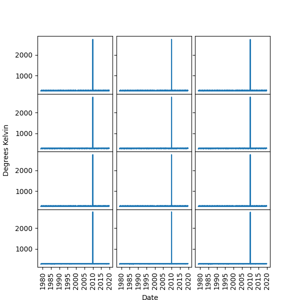
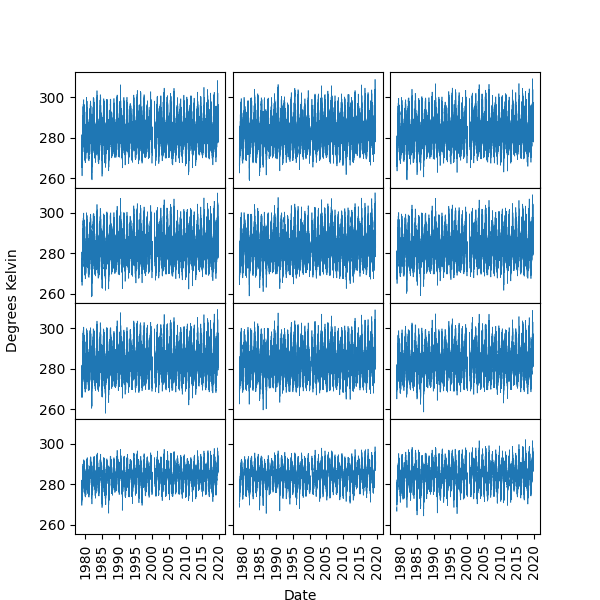
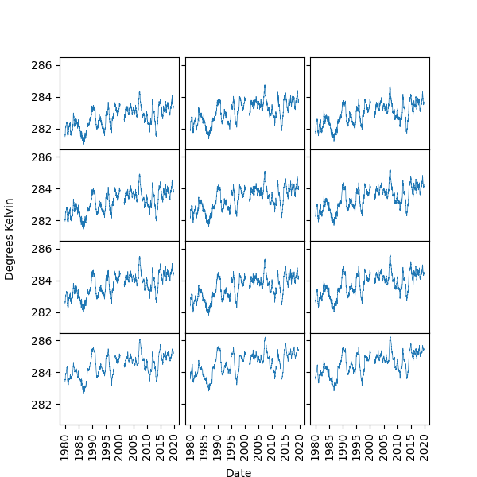

```{r setup, include=FALSE}
knitr::opts_chunk$set(echo = TRUE)
```

## Inspecting the Data

The file given provides temperature data for 13 different locations, most of which are in the UK (chart 1), however we can also see that the locations go across the channel and into France.

<div class = "row">
  <div class = "col-md-6" style="padding: 20px;">
  Chart 1: Plotting the geogrpahical coordinates
  {width=400px}
  </div>
</div>

When plotting the recorded temperatures, across any of the locations, we can see that there is a large spike in 2010 where temperatures are too large by a factor of 10 (chart 2).

These anomalies are corrected by making any value > 2000 degrees Kelvin a factor of 10 smaller. This corrects for the issue and gives a better picture as seen in chart 3. However, even in chart 3 you can see there is an extra issue with the dataset. For the year 2000 there is a break in the series for each location, if I had more time I would impute these values based on previous trends, but for now I have left them as NAs.


<div class = "row">

  <div class = "col-md-6" style="padding: 20px;">
  Chart 2: Anomalies in the time series data
  {width=400px} 
  </div>

  <div class = "col-md-6" style="padding: 20px;">
  Chart 3: Time series charts after anomaly correction
  {width=400px} 
  </div>
  
</div>

Chart 3 above is not that easy to interpret, so instead I have taken a 1 year moving average to be able to observe the trends better. Chart 4 below makes it more obvious that there is data missing in the year 2000. It also shows us there is an upward trend in temperatures for each location.

<div class = "row">
  <div class = "col-md-6" style="padding: 20px;">
  Chart 4: 1 Year moving average by location
  {width=400px}
  </div>
</div>


## Including Plots

You can also embed plots, for example:

```{r pressure, echo=FALSE}
plot(pressure)
```

Note that the `echo = FALSE` parameter was added to the code chunk to prevent printing of the R code that generated the plot.
